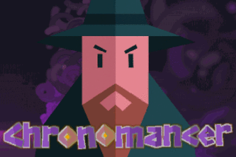

<!-- Improved compatibility of back to top link: See: https://github.com/pull/73 -->

<!-- PROJECT LOGO -->
 

  

  <h3 align="center">Divine Intellect Compiler</h3>

  

    Strategy game played over non-linear, acyclic time in medieval kingdoms synthesised from real cities. Developed using Rust, Z3 and Gamemaker! Winner at Hacknotts 2025!
     
     
    <a href="https://devpost.com/software/chronomancer">View Devpost</a>
    ·
    <a href="https://github.com//tobybenjaminclark/chronomancer/issues">Report Bug</a>
    ·
    <a href="https://github.com/tobybenjaminclark/chronomancer/issues">Request Feature</a>
  

<!-- ABOUT THE PROJECT -->
## About The Project

Chronomancer is a strategy game where you can make decisions in the past that affect the future, or the other way around. The aim is to avoid creating time paradoxes, such as scheduling the execution of the gnome king before his birthday party (which you state he must attend).

Rule a kingdom across a rich, non-linear orgy of timelines and causality. Chronomancer sits the player between past, present, and future, commanding history across real cities reborn as medieval kingdoms. Through gameplay that merges timetable schedulling and mindbending non-linearity, *Chronomancer* achieves the following:

- Implements a (toy) strategy game played across non-linear, acyclic time with interval-order events.
- Derives in-game kingdoms from real UK cities, with notable locations transformed into faction outposts.
- Verification of win/loss conditions (satisfiability) using fun, SMT-decidable first order logic.
- Visually intuitive interface built on interval-constrained event series, inspired by real horologes!
- Narrative arcs derived from symbolic constraints, with clankers (AI) acting them out!

(<a href="#readme-top">back to top</a>)

<!-- USAGE EXAMPLES -->
## Internals & Architecture

The majority of Chronomancer is programmed in Rust (Blazingly Fast), with the frontend developed in Gamemaker. This has been our largest hackathon undertaking in Rust (so far) and was a great choice!

- We interfaced with a hat-trick of Google APIs (Directions, Routes, Places) to translate modern cities into medieval gameworlds (translating geographical coordinates into a unit circle).
- These are assigned into initial factions (Gnomes, Centaurs and Trolls) using simple k-means clustering, and then rendered inside of the game, with custom emblems!
- Events are stored as a directed-acyclic graph inside of the controller, converting to interval order to display, circularly on the GUI.
- Decisions/ledgers (events) are generated symbolically (in terms of their effects), then clanker-fied by the OpenAI API to give better natural language description.
- If the player chooses to accept a ledger, the map-time formulation is encoded into SMT-decidable logic, and a potential, valid, timeline is proven against the generated constraints - if not, game over!

(<a href="#readme-top">back to top</a>)

<!-- CONTRIBUTING -->
## Contributing
Since the project was born out of a 24-hour hackathon, there are going to be issues and bugs - note the lack of installation guidance here as an example. If you wish to contribute to Chronomancer, please feel free to create a feature branch or raise an issue! If you encounter any big issues, or get really stuck - feel free to contact whoever you think is most relevant to the issue you are encountering. 

1. Fork the Project
2. Create your Feature Branch (`git checkout -b feature/AmazingFeature`)
3. Commit your Changes (`git commit -m 'Add some AmazingFeature'`)
4. Push to the Branch (`git push origin feature/AmazingFeature`)
5. Open a Pull Request

(<a href="#readme-top">back to top</a>)

<!-- LICENSE -->
## License

Distributed under the MIT License. See `LICENSE.txt` for more information.

(<a href="#readme-top">back to top</a>)

<!-- CONTACT -->
## Contributors
[Amber Swarbrick](https://github.com/aswarbs)
[Toby Clark](https://github.com/tobybenjaminclark)